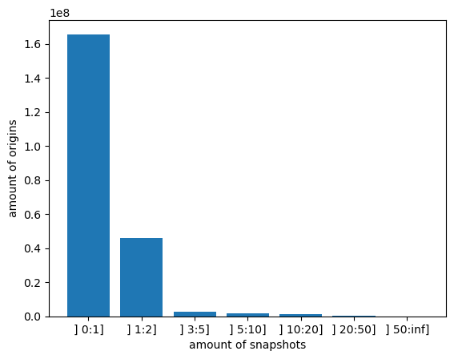

# Snapshots per Origin

- Median of snapshots per origin: `1.0`
- Average of snapshots per origin: `1.5`

There are `165_612_612` origins with one snapshot out of the `200_334_673` origins we analyzed.

If we exclude the origins with only one snapshot we go from `0.25%` to `1.4%` of origins with an altered history that we were able to find.